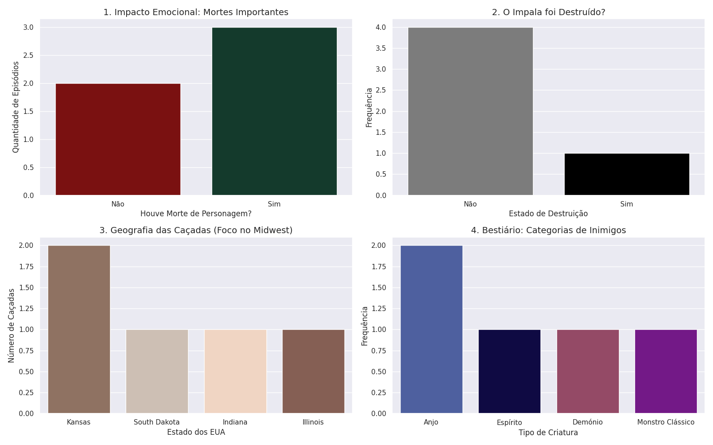

)

# supernatural-pandas-analysis
🦅 Saving people, hunting things, and analyzing data. A specialized Pandas dossier on the Winchester brothers' hunts, tracking everything from Impala damages to angelic encounters across the Midwest.

# 🦅 Supernatural Data Analysis with Pandas

Este projeto utiliza a biblioteca **Pandas** do Python para analisar dados das primeiras 5 temporadas da série *Supernatural*.

## 🚀 Tecnologias Utilizadas
* Python 3.x
* Pandas (Manipulação de dados)
* Matplotlib/Seaborn (Visualização)
* Google Colab

## 📈 O que foi analisado?
1. **Impacto Emocional:** Relação entre mortes de personagens e notas do IMDb.
2. **Estado do Impala:** Monitorização de danos no icónico Chevy Impala 67.
3. **Geografia:** Mapeamento das caçadas no Midwest americano.
4. **Bestiário:** Evolução das criaturas enfrentadas (de Fantasmas a Anjos).

## 📊 Visualizações

## 🛠️ Como correr o projeto
1. Abre o ficheiro `notebooks/supernatural_analysis.ipynb`
2. Clica no botão "Open in Colab"
3. Executa todas as células
